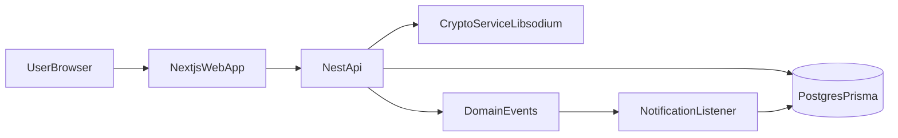
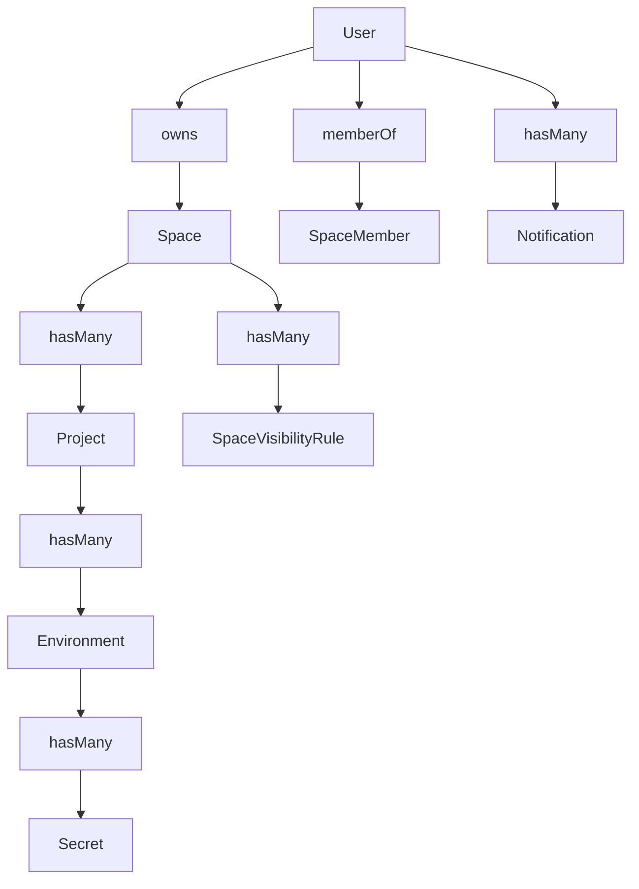
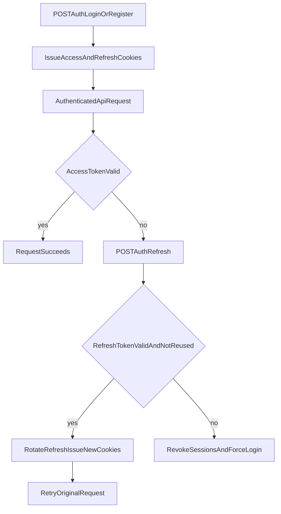
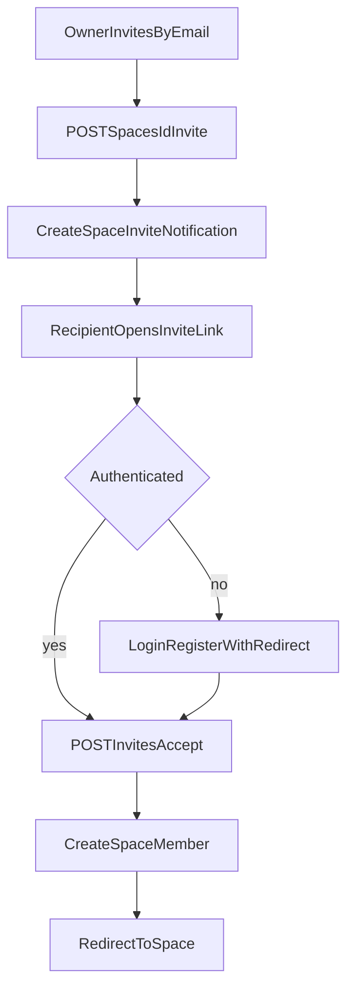
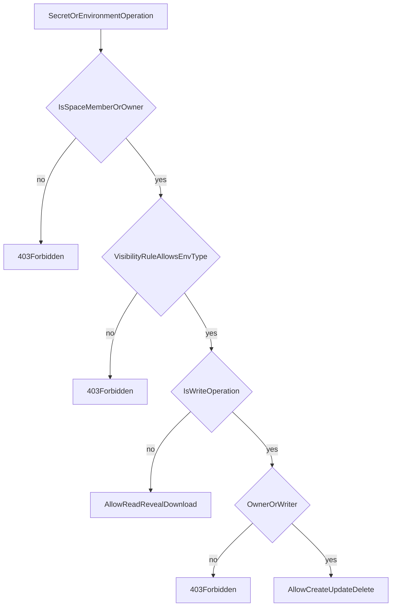
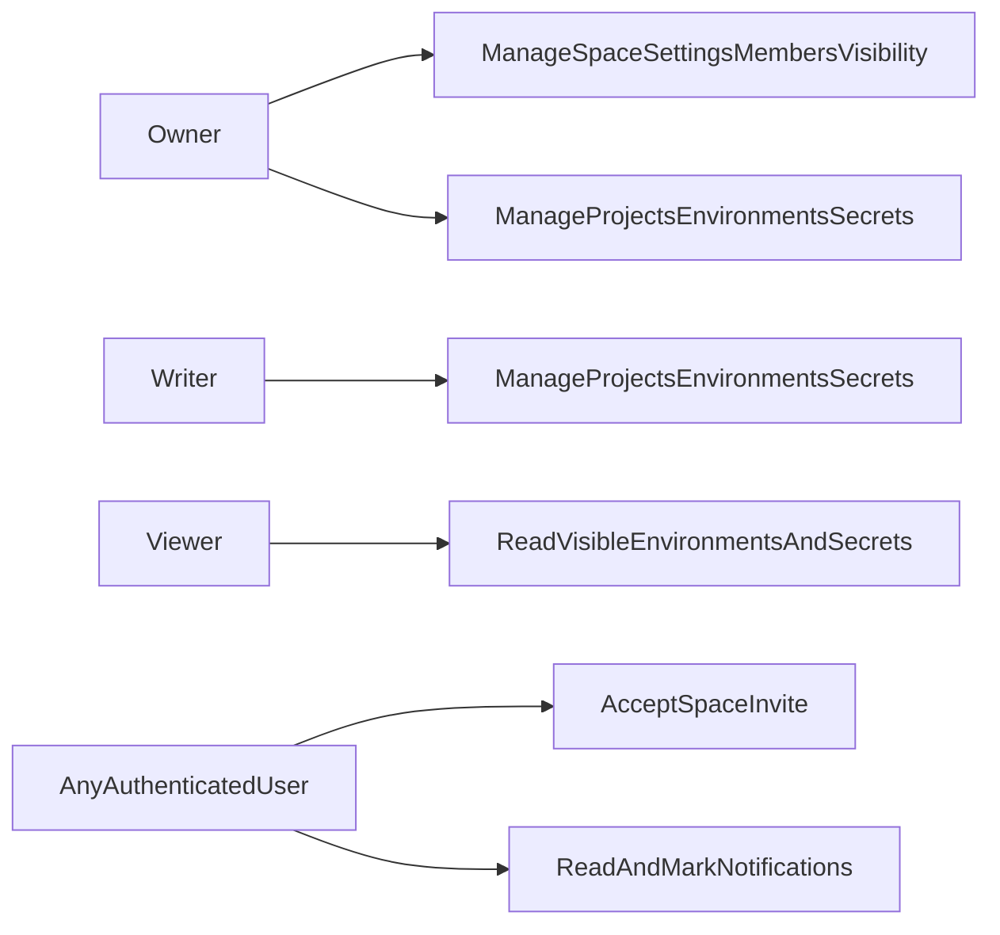

# Spacenv Context

This document captures domain context, architecture, access control, and critical system flows for the whole repository.

## 1) Product Context

Spacenv solves secure collaborative management of environment variables:

- Teams collaborate inside a **Space**
- Each space contains **Projects**
- Each project contains **Environments**
- Each environment contains **Secrets**

Security and collaboration are centered around:

- Cookie-based authenticated sessions
- Space-level roles (`OWNER`, `WRITER`, `VIEWER`)
- Per-space visibility rules by environment type (`OWNER_ONLY`, `WRITERS`, `ALL`)
- Event-driven in-app notifications

## 2) Monorepo Architecture

### Backend (`backend/`)

- Framework: NestJS
- Data: Prisma + PostgreSQL
- Auth: JWT in httpOnly cookies (`access_token`, `refresh_token`)
- Crypto: space-scoped DEK (`encDek`) + encrypted secret values
- Async domain signaling: EventEmitter2

Main modules:

- `auth`: login/register/oauth/session refresh
- `spaces`: spaces, memberships, invites, visibility rules
- `projects`: project CRUD under spaces
- `environments`: env CRUD + `.env` import
- `secrets`: secret CRUD + reveal + download
- `notifications`: in-app feed APIs + event listener
- `invites`: signed invite acceptance

### Frontend (`web/`)

- Framework: Next.js App Router
- Server state: TanStack Query
- UI state: Zustand
- API client: axios with `withCredentials: true`
- Notifications UX: dropdown + polling + mark read actions

Core app routes:

- `/dashboard`
- `/spaces/[spaceId]`
- `/spaces/[spaceId]/settings`
- `/projects/[projectId]`
- `/invite/[token]`
- `/login`, `/register`

## 3) Domain Model

Key entities:

- `Space`: tenant boundary, owner, encrypted DEK, visibility rules
- `SpaceMember`: membership + `role` (`VIEWER` | `WRITER`)
- `Project`: scoped to space
- `Environment`: scoped to project, typed (`PRODUCTION`, `STAGING`, `DEVELOPMENT`, `QC`, `OTHER`)
- `Secret`: encrypted value + IV, key per environment
- `Notification`: in-app event feed with metadata

## 4) Authorization Model

### Space roles

- **Owner**: `Space.ownerId` (implicit full access)
- **Writer**: can mutate projects/environments/secrets
- **Viewer**: read-only (subject to visibility rules)

### Visibility rules

Each space has one rule per environment type:

- `OWNER_ONLY`
- `WRITERS`
- `ALL`

Visibility gates both read and write operations where relevant:

- Listing/reading environments
- Listing/revealing/downloading secrets
- Secret mutation access (combined with writer requirement)

### High-level permission matrix

| Action | Owner | Writer | Viewer |
|---|---:|---:|---:|
| Create/update/delete space | yes | no | no |
| Invite/remove members | yes | no | no |
| Change member role | yes | no | no |
| Create/update/delete project | yes | yes | no |
| Create/update/delete environment | yes | yes | no |
| Import `.env` | yes | yes | no |
| Create/update/delete secret | yes | yes | no |
| Reveal/download secret values | yes | yes/no* | yes/no* |

\* depends on environment-type visibility rule.

## 5) Auth & Session Lifecycle

Implementation notes:

- Access token is read from `access_token` cookie by global JWT guard.
- Refresh token is hashed and tracked server-side in `RefreshToken`.
- Refresh reuse detection revokes sessions and blocks replay.
- OAuth (Google/GitHub) converges to same cookie session model.

## 6) Notifications Model

Events emitted by domain services:

- `project.created`, `project.updated`, `project.deleted`
- `environment.created`, `environment.updated`, `environment.deleted`
- `secrets.imported`, `secret.added`, `secret.updated`, `secret.deleted`
- `member.invited`

`NotificationListener` writes DB notifications for all space recipients except actor.

Metadata shape:

- `metadata.message` (human-readable text)
- optional `metadata.url` (deep link target)
- invite-only extras: `token`, `role`, `spaceName`

Frontend delivery:

- Pull-based query (`GET /notifications`) with periodic refetch
- mark-one / mark-all read mutations
- query invalidation on major writes to keep feed current

## 7) Invite Flow

Constraints:

- Invited user must already exist in system.
- Invite acceptance requires authenticated user email to match token payload.
- Membership is materialized on accept endpoint.

## 8) Secrets Access Decision Flow

## 9) Frontend Data/State Context

### Query keys and ownership

- `spaceKeys`: spaces list/detail/visibility
- `projectKeys`: project list/detail
- `envKeys`: environment list/detail
- `secretKeys`: secret list
- `notificationKeys`: notifications

### UI stores

- `ui.store`: active IDs + modal open states
- `auth.store`: current user/authenticated marker
- `secrets.store`: temporary revealed plaintext in memory only (TTL behavior)

### Cache behavior

- Most mutations invalidate relevant list/detail keys.
- Secrets writes and import perform immediate list refresh to update UI instantly.
- Notification cache is invalidated on write actions that emit notification events.

## 10) Primary Use Cases

## 11) API Surface Summary

Base prefix: `/api/v1`

- Auth: `/auth/*`, `/auth/me`
- Spaces: `/spaces`, `/spaces/:id`, `/spaces/:id/visibility`, `/spaces/:id/invite`, `/spaces/:id/members/:userId`
- Projects: `/spaces/:spaceId/projects`, `/projects/:id`
- Environments: `/projects/:projectId/environments`, `/environments/:id`, `/environments/:id/import`
- Secrets: `/environments/:envId/secrets`, `/environments/:envId/download`, `/secrets/:id/reveal`, `/secrets/:id`
- Notifications: `/notifications`, `/notifications/read`, `/notifications/:id/read`
- Invites: `/invites/accept`

## 12) Operational Context

- API docs are generated at runtime (`/docs`, `/yaml`, `/docs-json`).
- CORS is credentialed and tied to `FRONTEND_URL`.
- Cookie parser uses `COOKIE_SECRET`.
- Global guards:
  - throttling (`ttl=60s`, `limit=10`)
  - JWT auth (except `@Public` endpoints)
- Prisma schema and migrations are under `backend/prisma/`.

## 13) Known Gaps & Decisions

Track active and deferred gaps in:

- `/home/mahmoudmatter/personal-projects/spacenv/gaps.md`

Common examples already tracked there:

- No real-time push notifications (polling model)
- Some admin actions do not emit notifications
- Environment edit UI was previously missing and should be tracked against current implementation
